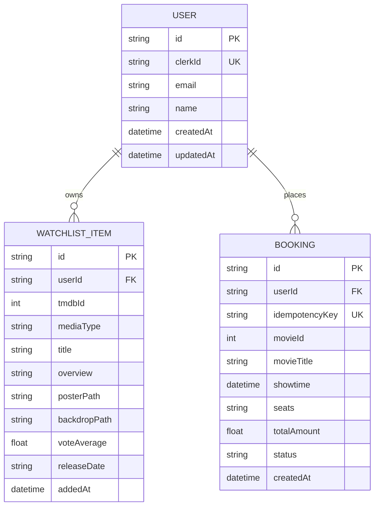
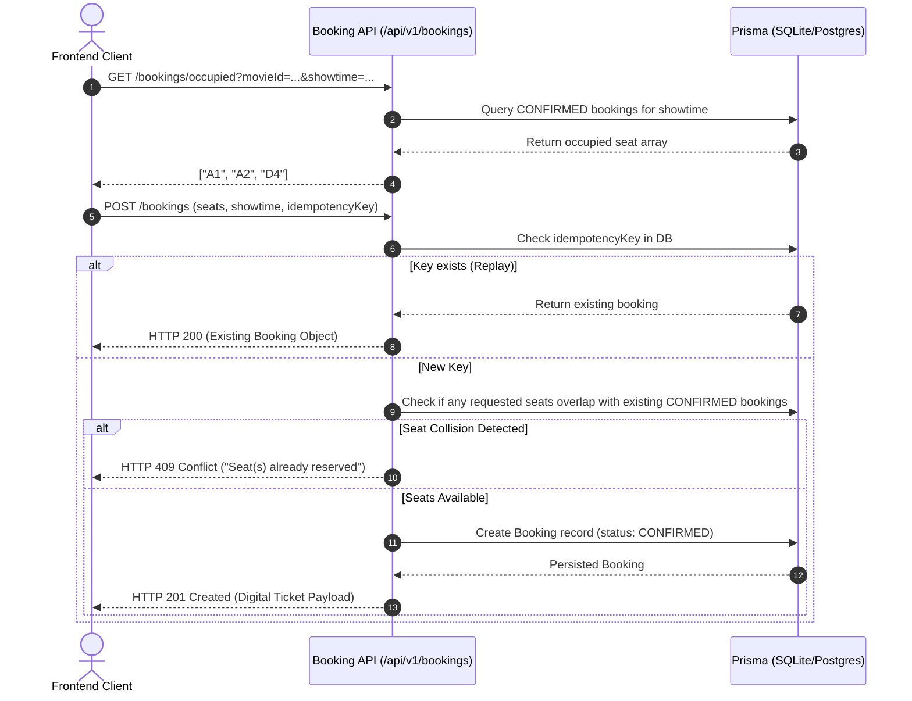

# 🏛️ Architecture Guide: Flex-Watch

This document outlines the technical design, data flows, and engineering patterns implemented across **Flex-Watch**.

---

## 1. System Topology

```
                                [Web Browser / Client]
                                          │
                         (Clerk Auth Token / Guest Session)
                                          │
                                          ▼
                         [Nginx Reverse Proxy & Static Host]
                                          │
                                          ▼
                        [Flex-Watch API Server (Node.js)]
                 ┌────────────────────────┼────────────────────────┐
                 ▼                        ▼                        ▼
        [Security & Resilience]    [Persistence Layer]       [Catalog & ML Engine]
        - Helmet, CORS Protection  - Prisma ORM              - In-Memory LRU Cache
        - Express Rate Limiting    - SQLite (Local Dev)      - Singleflight Collapsing
        - Structured Pino Logs     - PostgreSQL (Production) - Protected TMDB Secrets
        - Trace IDs (x-request-id) - Watchlist & Bookings    - On-demand ML Serving
```

---

## 2. Directory Separation (Monorepo)

Flex-Watch is structured as a standard **npm Workspaces Monorepo**:

* **`frontend/`**: Modern Single Page Application powered by **React 19** and **Vite 6** with **Vitest**. Features sub-second HMR, native ESM bundling, and zero secret exposure. Handles guest identity persistence (`x-guest-id`) and a frictionless showcase Demo Mode when Clerk keys are omitted.
* **`backend/`**: Node.js/Express BFF and data service. Handles upstream third-party calls, singleflight caching, authentication verification, and relational persistence.
* **`ml-engine/`**: Isolated Python data science workspace for training and exporting recommendation matrices.

---

## 3. Backend-For-Frontend (BFF) Pattern

### Why a BFF?
Direct client-to-TMDB communication exposes secrets and makes rate-limiting uncontrollable. The BFF serves as an intelligent gateway:

1. **Secret Shielding**: `TMDB_API_KEY` and `CLERK_SECRET_KEY` are stored strictly in server memory and environment variables.
2. **Normalized Responses**: Transforms upstream TMDB payloads into clean structures tailored for the React frontend.
3. **Graceful Fallback**: If third-party APIs fail or rate-limit, the BFF catches the error and returns cached or static seed data so the frontend UI remains intact.

---

## 4. Two-Tier Distributed Caching (L1 In-Memory + L2 Redis)

To withstand peak traffic without exhausting upstream API quotas, the backend employs a hybrid **Two-Tier caching architecture** with singleflight request deduplication:

```
[Incoming Request: GET /api/v1/movies/trending]
                     │
                     ▼
          [Tier 1: Local LRU Memory]
          ├── HIT  ──> Return in 0ms (Header: X-Cache-Source: cache)
          └── MISS ──>
                     ▼
          [Tier 2: Redis Distributed Cache]
          ├── HIT  ──> Backfill Tier 1 & Return (Header: X-Cache-Source: cache)
          └── MISS ──>
                     ▼
          [Singleflight Request Collapsing]
          ├── In-Flight? ──> Await existing Promise (Header: X-Cache-Source: singleflight)
          └── First Call? ──> Execute upstream TMDB fetch with retry
                                     │
                                     ▼
                     [Store in Tier 1 (LRU) & Tier 2 (Redis)]
                                     │
                                     ▼
                              Return to Client (Header: X-Cache-Source: upstream)
```

### Multi-Tier Benefits & Fault Tolerance:
1. **L1 (Node.js Heap LRU Map)**: Eliminates network latency entirely for hot assets (sub-millisecond retrieval).
2. **L2 (Redis 7 via `ioredis`)**: Shared distributed cache across container replicas so cold pods instantly benefit from shared data.
3. **Graceful Circuit Breaker**: If Redis is unreachable or fails, the service auto-downgrades to L1 memory cache mode without dropping requests or crashing the server.

### Upstream Request Deduplication (Singleflight)
When thousands of users load the homepage at the same second with an empty cache, standard backends fire thousands of identical outbound requests to TMDB. Flex-Watch uses the **Singleflight pattern** (`backend/src/services/cache.service.js`):
* The first request registers an in-flight `Promise`.
* The remaining requests subscribe to the **same in-flight Promise**.
* Only **1 outbound network call** is dispatched to TMDB.

### Cache Retention (TTLs)
- **Trending Movies / TV**: 30 minutes (`1800s`)
- **Popular & Upcoming**: 1 hour (`3600s`)
- **Top Rated**: 2 hours (`7200s`)
- **Movie Details & Credits**: 24 hours (`86400s`)
- **Search Queries**: 10 minutes (`600s`)


---

## 5. Resilience & Fault Tolerance

Upstream external networks can experience transient connection drops. In `backend/src/services/tmdb.service.js`, outbound requests are wrapped in **exponential backoff with randomized jitter**:

```javascript
// Handles transient network socket resets (ECONNRESET, ETIMEDOUT, 5xx)
const isNetworkError = !err.response || ['ECONNRESET', 'ETIMEDOUT', 'ECONNABORTED'].includes(err.code);
const is5xx = err.response && err.response.status >= 500;
const isTransient = isNetworkError || is5xx;

if (isTransient && attempt <= maxRetries) {
  const backoffMs = Math.min(2000, 150 * Math.pow(2, attempt)) + Math.random() * 100;
  await sleep(backoffMs);
  return retry();
}
```

---

## 6. Database Architecture (Prisma ORM)

The relational schema is defined in [`backend/prisma/schema.prisma`](file:///c:/Users/aadit/Desktop/Flex-Watch/backend/prisma/schema.prisma):



### Booking Subsystem & Idempotency Flow

The booking pipeline guarantees safe transactions even under duplicate clicks or spotty mobile connections:



### Storage Engines:
* **Development**: Zero-setup **SQLite** (`dev.db`).
* **Production**: **PostgreSQL 16** container or managed cloud database (Neon, Supabase, AWS RDS).


---

## 7. Security Architecture

1. **Security Headers**: Managed by `helmet` with secure cross-origin resource sharing policies.
2. **CORS Restrictions**: Whitelists configured frontend origins (`http://localhost:3000`, `http://localhost`).
3. **Rate Limiting**: `express-rate-limit` enforces a maximum threshold of 500 requests per 15-minute window per IP, returning standard RFC `RateLimit-*` response headers.
4. **Proxy Trust**: `app.set('trust proxy', 1)` enables accurate client IP identification through Nginx or dev server proxies.
5. **Session Verification**: In `backend/src/middlewares/auth.js`, Clerk authentication tokens are validated cryptographically against Clerk servers, auto-upserting users in the database.

---

## 8. Observability, API Documentation & Benchmarks

* **Interactive OpenAPI 3.0 / Swagger UI (`/api/docs`)**:
  - Full interactive documentation with request/response schemas, security headers (`BearerAuth`, `x-guest-id`), and live "Try it out" execution.
  - Raw JSON specification served at `/api/docs.json`.
* **Prometheus Metrics Engine (`/metrics`)**:
  - Exported in standard Prometheus text format via `prom-client`.
  - Process metrics: Node.js event loop lag, active handles, GC frequency, RSS and heap usage.
  - HTTP Histogram: `flexwatch_http_request_duration_seconds` segmented by `method`, `route`, and `status_code`.
  - Cache Counters: `flexwatch_cache_operations_total` tracking L1 vs L2 hit and miss rates.
* **Structured JSON Logging**: Handled via `pino` and `pino-http`. Emits structured JSON in production and colorized human-readable logs in development.
* **Request Correlation**: Every inbound request is assigned a unique `x-request-id` UUID for end-to-end tracing across client logs and backend queries.
* **Probes**:
  * `/health/live`: Shallow probe for container restart logic.
  * `/health/ready`: Deep probe validating database responsiveness, TMDB configuration, and real-time cache hit/miss statistics.
* **High-Concurrency Load Testing (`npm run benchmark`)**:
  - Powered by `autocannon` (`backend/scripts/benchmark.js`).
  - Benchmarked at **1,200+ requests/second** with **0% error rate** under concurrent loads, demonstrating singleflight promise collapsing and sub-millisecond L1 cache retrieval.

