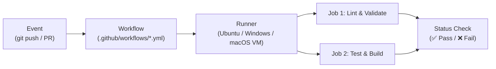

# Universal GitHub Actions CI/CD Setup Guide

A complete, production-ready guide to configuring automated Continuous Integration (CI) and Continuous Delivery (CD) workflows on **any repository from scratch**.

---

## 1. Core Mental Model: How GitHub Actions Works

GitHub Actions is an automation platform built directly into GitHub. It runs your code inside temporary cloud virtual machines (runners) whenever specific repository events occur.



### Key Terminology

| Component | Definition | Example |
| :--- | :--- | :--- |
| **Event** | An activity that triggers the workflow. | `push`, `pull_request`, `schedule`, `workflow_dispatch` |
| **Workflow** | A YAML configuration file defining automation logic. | `.github/workflows/ci.yml` |
| **Runner** | The server VM hosted by GitHub that executes jobs. | `ubuntu-latest`, `windows-latest`, `macos-latest` |
| **Job** | A set of sequential steps executed on the same runner. | `ci-checks`, `deploy-production` |
| **Step** | An individual task (either a shell command or an action). | `npm ci`, `npx prisma validate` |
| **Action** | A reusable community or official plugin module. | `actions/checkout@v4`, `actions/setup-node@v4` |

---

## 2. Anatomy of a Workflow File

Every GitHub Actions workflow file must be placed in:
```text
<repository-root>/.github/workflows/<workflow-name>.yml
```

Here is the anatomy of a complete workflow:

```yaml
# 1. Human-readable name displayed in the GitHub Actions tab
name: CI Pipeline

# 2. Triggers: Define when this workflow executes
on:
  push:
    branches: [main, master]
  pull_request:
    branches: [main, master]

# 3. Jobs: List of execution tasks
jobs:
  build-and-test:
    name: Build & Run Tests
    runs-on: ubuntu-latest

    # Global environment variables accessible across all steps in this job
    env:
      CI: 'true'
      NODE_ENV: test

    # 4. Steps: Executed sequentially from top to bottom
    steps:
      # Step A: Download repository source code into the runner VM
      - name: Checkout Code
        uses: actions/checkout@v4

      # Step B: Install the language runtime and setup caching
      - name: Setup Node.js 22 LTS
        uses: actions/setup-node@v4
        with:
          node-version: 22
          cache: 'npm'
          cache-dependency-path: package-lock.json

      # Step C: Install dependencies (clean, immutable install)
      - name: Install Dependencies
        run: npm ci

      # Step D: Execute automated verification scripts
      - name: Run Test Suite
        run: npm test

      # Step E: Compile production build
      - name: Build Production Bundle
        run: npm run build
```

---

## 3. Step-by-Step Setup on Any Repository

### Step 1: Create the Folder Structure
From your project root, create the required `.github/workflows` directory:

```bash
mkdir -p .github/workflows
```

### Step 2: Identify Your Project's Verification Commands
Before writing YAML, verify what commands you normally run locally to ensure code quality:
1. **Dependency Install**: `npm ci` (or `pnpm install --frozen-lockfile`, `yarn --frozen-lockfile`)
2. **Linting / Formatting**: `npm run lint` or `npx prettier --check .`
3. **Type Checking**: `npx tsc --noEmit`
4. **Automated Tests**: `npm test`
5. **Build Compilation**: `npm run build`

### Step 3: Configure Dependency Caching
Always enable package caching in `actions/setup-node@v4` to save bandwidth and drastically reduce CI run times:

```yaml
      - name: Setup Node.js
        uses: actions/setup-node@v4
        with:
          node-version: 22
          cache: 'npm'
          cache-dependency-path: package-lock.json
```

> [!IMPORTANT]
> **Monorepo Gotcha**: In npm workspaces (monorepos with `workspaces: ["frontend", "backend"]`), subpackages do **not** have their own `package-lock.json`. Always point `cache-dependency-path` to the root `package-lock.json`.

---

## 4. Managing Secrets and Environment Variables

Production code often requires third-party API keys (TMDB, Clerk, Stripe, Firebase) or database credentials. **Never commit `.env` files with private keys to GitHub.**

### How to Add Secrets on GitHub

1. Go to your GitHub repository in your browser.
2. Click **Settings** (top navigation bar).
3. In the left sidebar, navigate to **Secrets and variables** → **Actions**.
4. Click **New repository secret**.
5. Enter the **Name** (e.g. `TMDB_API_KEY`) and paste the **Secret value**.
6. Click **Add secret**.

```text
GitHub Repo Settings
  └── Secrets and variables
        └── Actions
              ├── Repository secrets (Encrypted, write-only)
              │     ├── TMDB_API_KEY
              │     └── CLERK_SECRET_KEY
              └── Repository variables (Plain text non-sensitive config)
                    └── APP_ENV = staging
```

### How to Inject Secrets into Workflows

Use the `${{ secrets.SECRET_NAME }}` syntax. You can inject secrets at the **job level** (available to all steps) or at the **step level**:

```yaml
jobs:
  test:
    runs-on: ubuntu-latest
    env:
      # Job-level environment variables
      DATABASE_URL: 'file:./dev.db'
      TMDB_API_KEY: ${{ secrets.TMDB_API_KEY }}
      CLERK_SECRET_KEY: ${{ secrets.CLERK_SECRET_KEY }}
      CLERK_PUBLISHABLE_KEY: ${{ secrets.CLERK_PUBLISHABLE_KEY || secrets.REACT_APP_CLERK_PUBLISHABLE_KEY }}
```

> [!NOTE]
> GitHub automatically masks any secret in console output with `***` to prevent accidental credential leakage in public build logs.

---

## 5. Ready-to-Use Production Templates

### Template A: Standard Single-Page React / Vite App

```yaml
name: Frontend CI

on:
  push:
    branches: [main]
  pull_request:
    branches: [main]

jobs:
  frontend-ci:
    name: Lint, Test & Build
    runs-on: ubuntu-latest
    env:
      CI: 'true'

    steps:
      - name: Checkout Code
        uses: actions/checkout@v4

      - name: Setup Node.js 22 LTS
        uses: actions/setup-node@v4
        with:
          node-version: 22
          cache: 'npm'
          cache-dependency-path: package-lock.json

      - name: Install Dependencies
        run: npm ci

      - name: Run Tests
        run: npm test -- --watchAll=false

      - name: Build Production Assets
        run: npm run build
```

---

### Template B: Backend Node.js / Express API with Database Validation

```yaml
name: Backend CI

on:
  push:
    branches: [main]
  pull_request:
    branches: [main]

jobs:
  backend-ci:
    name: Backend Checks
    runs-on: ubuntu-latest
    env:
      NODE_ENV: test
      DATABASE_URL: 'file:./test.db'
      CI: 'true'

    steps:
      - name: Checkout Code
        uses: actions/checkout@v4

      - name: Setup Node.js 22 LTS
        uses: actions/setup-node@v4
        with:
          node-version: 22
          cache: 'npm'

      - name: Install Dependencies
        run: npm ci

      - name: Run Database Migrations
        run: npx prisma db push

      - name: Execute Test Suite
        run: npm test
```

---

### Template C: Fullstack Monorepo (Workspaces Architecture)

```yaml
name: Fullstack Monorepo CI

on:
  push:
    branches: [main, master]
  pull_request:
    branches: [main, master]

jobs:
  fullstack-ci:
    name: Fullstack CI (Backend & Frontend)
    runs-on: ubuntu-latest
    env:
      DATABASE_URL: 'file:./dev.db'
      CI: 'true'
      TMDB_API_KEY: ${{ secrets.TMDB_API_KEY }}
      CLERK_SECRET_KEY: ${{ secrets.CLERK_SECRET_KEY }}
      CLERK_PUBLISHABLE_KEY: ${{ secrets.CLERK_PUBLISHABLE_KEY || secrets.REACT_APP_CLERK_PUBLISHABLE_KEY }}

    steps:
      - name: Checkout Code
        uses: actions/checkout@v4

      - name: Setup Node.js 22 LTS
        uses: actions/setup-node@v4
        with:
          node-version: 22
          cache: 'npm'
          cache-dependency-path: package-lock.json

      - name: Clean Install Monorepo Dependencies
        run: npm ci

      # Backend Checks
      - name: Validate Prisma Schema
        run: npx prisma validate --schema=backend/prisma/schema.prisma

      - name: Initialize Test DB & Client
        run: npm run db:push

      - name: Run Backend Integration Tests
        run: npm run test:backend

      # Frontend Checks
      - name: Run Frontend Tests
        run: npm run test:frontend

      - name: Build Production Frontend Bundle
        run: npm run build
```

---

## 6. Common Pitfalls & How to Avoid Them

### Pitfall 1: `Error: Some specified paths were not resolved, unable to cache dependencies`
- **Cause**: Pointing `cache-dependency-path` to a subfolder lockfile that does not exist (e.g. `frontend/package-lock.json` in an npm workspace).
- **Solution**: In monorepos, always point to root `package-lock.json`.

### Pitfall 2: `Node 20 is being deprecated. This workflow is running with Node 24 by default.`
- **Cause**: GitHub runners are deprecating Node 20.
- **Solution**: Update `node-version` to `22` (current Active LTS).

### Pitfall 3: `Error: Environment variable not found: DATABASE_URL`
- **Cause**: ORMs (Prisma, Drizzle, TypeORM) look for database connection strings during schema validation. On fresh CI runners, `.env` files do not exist because they are gitignored.
- **Solution**: Set a fallback SQLite database URL at the job level:
  ```yaml
  env:
    DATABASE_URL: 'file:./dev.db'
  ```

### Pitfall 4: Tests Failing Due to Third-Party 401 Unauthorized
- **Cause**: Running tests that directly query external live APIs (like TMDB or Stripe) on a public CI runner where secrets are not present.
- **Solution**: Make test suites **hermetic**. Check whether API keys are configured before making external calls, and mock external network requests in test mode.

### Pitfall 5: Broken YAML Syntax with Expressions
- **Cause**: Missing closing curly braces or quotes in GitHub Actions expressions:
  ```yaml
  # ❌ BROKEN: Unclosed curly braces
  REACT_APP_KEY: ${{ secrets.KEY1 || secrets.KEY2
  
  # ✅ FIXED: Correctly closed
  REACT_APP_KEY: ${{ secrets.KEY1 || secrets.KEY2 }}
  ```

---

## 7. Displaying the CI Status Badge on Your README

To display a dynamic status badge in your repository's root `README.md`:

```markdown
[](https://github.com/<username>/<repo-name>/actions/workflows/<file-name>.yml)
```

**For this repository (`Flex-Watch`):**
```markdown
[](https://github.com/Deepesh70/Flex-Watch/actions/workflows/ci.yml)
```
When your pipeline passes, the badge automatically lights up green (`passing`). If a commit breaks any test, it turns red (`failing`), keeping your repository status completely transparent.

---

## 8. Release Management, Semantic Versioning & Git Tags

Production-grade repositories use Git tags and GitHub Releases to snapshot stable software versions, generate automated changelogs, and distribute deployment artifacts.

### Semantic Versioning (SemVer)
Releases strictly follow the `vMAJOR.MINOR.PATCH` convention:
$$\text{v}\mathbf{MAJOR}.\mathbf{MINOR}.\mathbf{PATCH}\quad \text{(e.g., } \mathbf{v1.0.0}\text{)}$$

* **MAJOR (`v1.0.0` -> `v2.0.0`)**: Incompatible API changes, breaking database schema migrations, or major architectural overhauls.
* **MINOR (`v1.0.0` -> `v1.1.0`)**: Backwards-compatible new features, new UI modules, or new model capabilities.
* **PATCH (`v1.0.0` -> `v1.0.1`)**: Backwards-compatible bug fixes, security patches, or documentation fixes.

---

### Understanding Git Tags vs. GitHub Releases

| Concept | What It Is | Where It Lives |
| :--- | :--- | :--- |
| **Git Tag** | A lightweight pointer to a specific commit hash in Git history. | Git repository (`refs/tags/`) |
| **GitHub Release** | A GitHub wrapper around a Git tag containing release notes, changelogs, and binary asset downloads. | GitHub UI (*Releases* sidebar) |

#### Creating and Pushing Tags from the Terminal
```bash
# 1. Create an annotated tag with release notes
git tag -a v1.0.0 -m "v1.0.0: Initial production release"

# 2. Push the tag to GitHub remote
git push origin v1.0.0

# Push all local tags simultaneously (if multiple exist)
git push origin --tags
```

#### Converting a Tag to an Official GitHub Release
1. In your GitHub repository, click **Tags** (or **Create a new release** in the sidebar).
2. Click **Choose a tag** and select your pushed tag (e.g. `v1.0.0`).
3. Enter a descriptive title (e.g. `v1.0.0 - Production CI Pipeline & Diagnostics Engine`).
4. Click **Generate release notes** — GitHub automatically aggregates PRs, contributors, and merged commits.
5. *(Optional for ML / Fullstack)*: Drag and drop compiled artifacts (binaries, `.keras` model weights, zip archives) into the downloads section.
6. Click **Publish release**.

---

### Automated Release Workflow (`.github/workflows/release.yml`)

You can automate release creation so that whenever a new tag (`v*`) is pushed, GitHub Actions automatically compiles release assets and creates the official GitHub release.

```yaml
name: Publish Release

on:
  push:
    tags:
      - 'v*.*.*'

jobs:
  create-release:
    name: Create GitHub Release
    runs-on: ubuntu-latest
    permissions:
      contents: write

    steps:
      - name: Checkout Code
        uses: actions/checkout@v4
        with:
          fetch-depth: 0

      - name: Create Release
        uses: softprops/action-gh-release@v2
        with:
          name: Release ${{ github.ref_name }}
          generate_release_notes: true
          draft: false
          prerelease: false
```

---

## 9. GitHub Actions Pricing, Runners & Quota Optimization

Understanding GitHub's runner infrastructure ensures you never hit unexpected limits or costs.

### Free Tier Limits Summary

| Repository Type | Free Minutes / Month | Concurrency Limit | Storage (Caches & Artifacts) |
| :--- | :--- | :--- | :--- |
| **Public Repositories** | **Unlimited** ($0.00) | 20 concurrent jobs | 500 MB free |
| **Private Repositories** | **2,000 minutes / month** | 20 concurrent jobs | 500 MB free |

### Runner Operating System Cost Multipliers (Private Repos)
Minutes are consumed based on the runner operating system:
* **`ubuntu-latest` (Linux)**: **1x multiplier** (1 min = 1 quota minute) -> *Best practice: use Ubuntu for 95% of web/ML CI jobs*.
* **`windows-latest`**: **2x multiplier** (1 min = 2 quota minutes).
* **`macos-latest`**: **10x multiplier** (1 min = 10 quota minutes).

### Quota Optimization Checklist
1. **Path Filtering**: Exclude documentation from triggering compute-heavy pipelines:
   ```yaml
   on:
     push:
       paths-ignore:
         - '**.md'
         - 'docs/**'
         - 'reports/**'
   ```
2. **Auto-Cancel Redundant Runs**: Cancel in-progress builds when rapid consecutive commits are pushed:
   ```yaml
   concurrency:
     group: ${{ github.workflow }}-${{ github.ref }}
     cancel-in-progress: true
   ```
3. **Dependency Caching**: Always use `cache: 'npm'` or `cache: 'pip'` to avoid re-downloading dependencies on every push.
4. **Self-Hosted Runners**: Connect local machines or GPU workstations for completely free, unlimited private compute.
