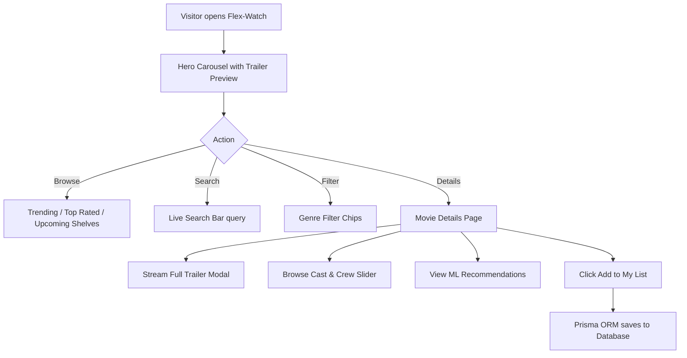

# 🌟 Project Overview: Flex-Watch

## 1. What is Flex-Watch?

**Flex-Watch** is a full-stack, enterprise-grade movie discovery and streaming web application inspired by BookMyShow and Netflix. It allows users to browse trending releases, explore detailed cast and crew metadata, stream trailer previews, manage a personalized and database-persisted watchlist, and receive **Machine Learning-powered movie recommendations** — all wrapped in a sleek, cinematic dark-themed UI.

---

## 2. Core Architectural Pillars

### 🛡️ 1. Complete Secret Isolation & BFF Pattern
- Third-party API keys (TMDB, Clerk secret key) are never exposed to the client browser.
- All outbound requests are proxied and secured through a dedicated **Backend-For-Frontend (BFF)** service in `backend/`.

### ⚡ 2. High-Performance Multi-Tier Caching
- **Singleflight Request Deduplication**: Collapses concurrent identical requests for trending movies or movie details into a single in-flight promise, preventing cache stampedes.
- **In-Memory LRU Cache & Redis Support**: Delivers cached catalog responses in under 2 milliseconds, insulating the platform from upstream rate limits.

### 💾 3. Reliable Relational Persistence
- Replaced fragile browser `localStorage` with a **Prisma ORM** database layer.
- Supports zero-config **SQLite** (`dev.db`) for immediate local development, seamlessly switching to **PostgreSQL** in production with zero code changes.

### 🧠 4. On-Demand Machine Learning Recommendations
- A content-based recommendation engine (`ml-engine/`) trained on ~4,800 titles using cosine similarity across genres, keywords, cast, and director features.
- Recommendations are served dynamically by the backend API on-demand, removing heavy static JSON bloat from the client bundle.

---

## 3. Technology Stack Breakdown

### Frontend (`frontend/`)
* **Framework**: React 19 (`react: ^19.2.3`, `react-dom: ^19.2.3`)
* **Routing**: React Router v7 (`react-router-dom: ^7.11.0`)
* **Styling**: Tailwind CSS 3.4 (`tailwindcss: ^3.4.19`, custom cinematic dark palette)
* **Authentication**: Clerk React (`@clerk/clerk-react: ^5.61.9`)
* **State Management**: React Context (`Movies.context.jsx`) with optimistic UI sync
* **Carousels**: React Slick (`react-slick: ^0.31.0`, `slick-carousel`)
* **Icons**: React Icons (`react-icons: ^5.5.0`)

### Backend (`backend/`)
* **Runtime**: Node.js v20+ with Express 4
* **Database ORM**: Prisma ORM (`@prisma/client: ^6.4.1`)
* **Database Engines**: SQLite (development) / PostgreSQL 16 (production)
* **Caching**: In-memory LRU with TTLs + Singleflight promise collapsing + Redis 7 support
* **Security**: Helmet, CORS origin restriction, and Express Rate Limiter
* **Logging & Observability**: Pino structured JSON logger with `x-request-id` tracing
* **Validation**: Zod runtime schema validation

### Machine Learning (`ml-engine/`)
* **Runtime**: Python 3.9+
* **Data Processing**: pandas, numpy
* **Similarity Modeling**: scikit-learn (Cosine Similarity matrix computation)

### DevOps & Infrastructure
* **Monorepo**: npm Workspaces (`workspaces: ["frontend", "backend"]`)
* **Containerization**: Multi-stage Dockerfiles (non-root security)
* **Orchestration**: Docker Compose (PostgreSQL + Redis + Express API + Nginx Web)
* **CI/CD**: GitHub Actions (`.github/workflows/ci.yml`)

---

## 4. User Journey & Core Workflows

